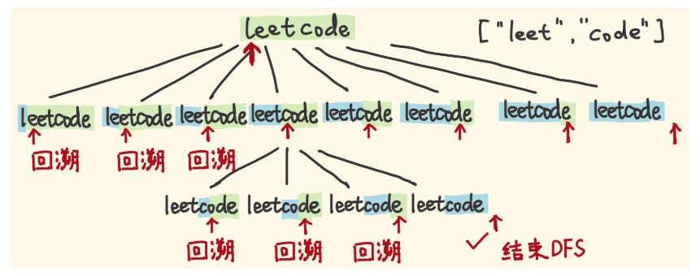
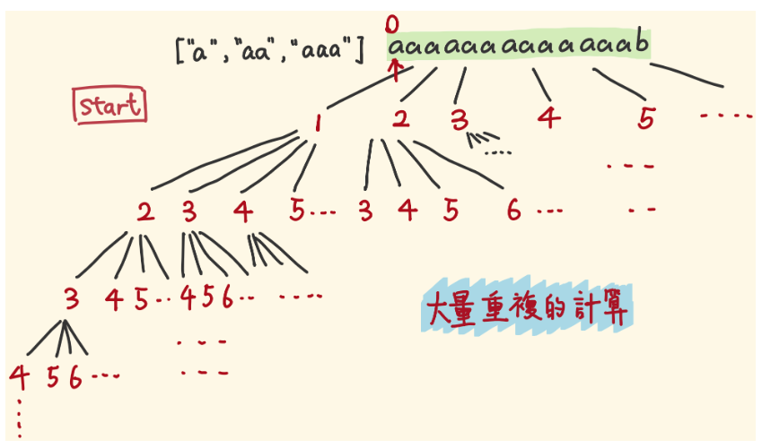
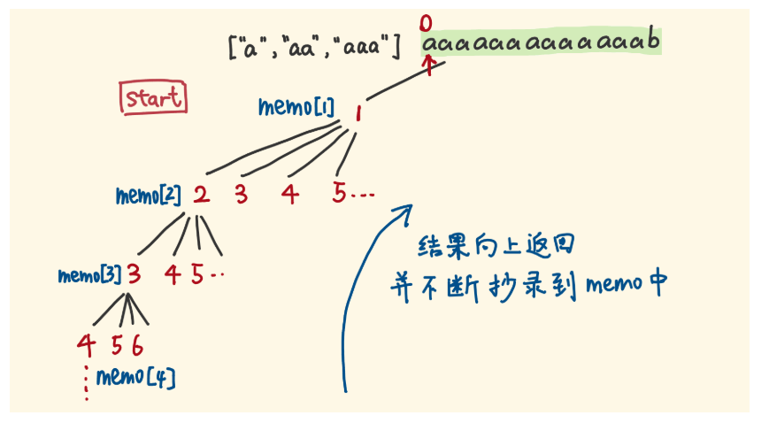

# Word-Break I
DFS with memo and dynamic programming.

记忆化深度优先搜索与动态规划。

Leetcode 139. Word Break

Given a non-empty string s and a dictionary wordDict containing a list of non-empty words, determine if s can be segmented into a space-separated sequence of one or more dictionary words.

**Note:**

- The same word in the dictionary may be reused multiple times in the segmentation.
- You may assume the dictionary does not contain duplicate words.

## Example 1
```
Input: s = "leetcode", wordDict = ["leet", "code"]
Output: true
Explanation: Return true because "leetcode" can be segmented as "leet code".
```
## Example 2
```
Input: s = "applepenapple", wordDict = ["apple", "pen"]
Output: true
Explanation: Return true because "applepenapple" can be segmented as "apple pen apple".
             Note that you are allowed to reuse a dictionary word.
```

## Example 3
```
Input: s = "catsandog", wordDict = ["cats", "dog", "sand", "and", "cat"]
Output: false
```

## Solution 1 -- Brute force

```java
class Solution {
    public boolean wordBreak(String text, List<String> wordDict) {
        // brute force
        // break down the text letter by letter
        // check the HashSet whether the letter exists
        // time: O(2^N) where N is the length of the text
        if ( text.length() == 0 ) {
            return false;
        }
        HashSet<String> dict = new HashSet<String>();
        for( String word : wordDict ) {
            dict.add(word);
        }
        return wordBreakSearchHelper(text, 0, dict);
    }

    private boolean wordBreakSearchHelper(String text, 
                                        int breakpoint, 
                                        HashSet<String> dict) {       
        if ( breakpoint == text.length() ) {
            return true;    // recursion exit
        }

        // backtracking 
        for ( int i = breakpoint; i <= text.length(); i++ ) {
            // [lastpoint, breakpoint)
            if ( !dict.contains(text.substring(breakpoint, i)) ) {
                continue;
            }
            boolean canBreak = wordBreakSearchHelper(text, i, dict); // recursion
            if ( canBreak ) {
                return true;
            }
        }
        return false;
    }
}
```
时间复杂度: O(2^N)

遇到类似这种输入，会花费很大代价。
```
"aaaaaaaaaaaaaaaaaaaaaaaaaaaaaaaaaaaaaaaaaaaaaaaaaaaaaaaaaaaaaaaaaaaaaaaaaaaaaaaaaaaaaaaaaaaaaaaaaaaaaaaaaaaaaaaaaaaaaaaaaaaaaaaaaaaaaaaaaaaaaaaaaaaaaab"
["a","aa","aaa","aaaa","aaaaa","aaaaaa","aaaaaaa","aaaaaaaa","aaaaaaaaa","aaaaaaaaaa"]
```

## Solution 2 DFS with memo -- 记忆化搜索



- 其实很多子树是搜索过的，记忆化就是为了阻止进一步递归。
- 这里子树的含义是，从某个地方break，这个breakpoint前面已经证明是可以break的。“这个地方后面的一段能不能继续break成字典里面的单词”就是子树的含义。
- 而我们这颗子树，有时候是会被搜索过的。

### How to use memo to prune?


```java
class Solution {
    public boolean wordBreak(String text, List<String> wordDict) {
        // brute force
        // break down the text letter by letter
        // check the HashSet whether the letter exists
        // time: O(2^N) where N is the length of the text
        if ( text.length() == 0 ) {
            return false;
        }
        HashSet<String> dict = new HashSet<String>();
        for( String word : wordDict ) {
            dict.add(word);
        }
        boolean[] breakpointVisited = new boolean[text.length()];
        boolean[] breakpointMemo = new boolean[text.length()];   // remember the words that make you
        return wordBreakSearchHelper(text, 0, dict, breakpointVisited, breakpointMemo);
    }

    private boolean wordBreakSearchHelper(String text, 
                                        int breakpoint, 
                                        HashSet<String> dict,
                                        boolean[] breakpointVisited,
                                        boolean[] breakpointMemo) {       
        if ( breakpoint == text.length() ) {
            return true;    // recursion exit
        }

        // backtracking 
        boolean canBreak = false;
        for ( int i = breakpoint; i < text.length(); i++ ) {
            // [lastpoint, breakpoint)
            if ( !dict.contains(text.substring(breakpoint, i+1)) ) {
                continue;
            }
            if ( breakpointVisited[breakpoint] ) {
                return breakpointMemo[breakpoint];   // prevent recursion to prune
            }
            // recursion
            canBreak = wordBreakSearchHelper(text, i+1, dict, breakpointVisited, breakpointMemo); 
            if ( canBreak ) {
                return true;
            }
        }
        // this should be outside the for loop
        breakpointVisited[breakpoint] = true;
        breakpointMemo[breakpoint] = canBreak;
        return false;
    }
}
```
