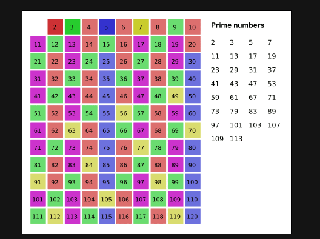

# Count Primes

Count the number of prime numbers less than a non-negative number, n.

## 埃氏筛



```java
class Solution {
    
    public int countPrimes(int n) {
        boolean[] isPrim = new boolean[n];
        Arrays.fill(isPrim, true);
        // 从 2 开始枚举到 sqrt(n)。
        for (int i = 2; i * i < n; i++) {
            // 如果当前是素数
            if (isPrim[i]) {
                // 就把从 i*i 开始，i 的所有倍数都设置为 false。
                for (int j = i * i; j < n; j+=i) {
                    isPrim[j] = false;
                }
            }
        }

        // 计数
        int cnt = 0;
        for (int i = 2; i < n; i++) {
            if (isPrim[i]) {
                cnt++;
            }
        }
        return cnt;
    }
}
```

- 时间复杂度：O(nloglogn)。证明不需要掌握，知道结论即可。其实很好算，是各个质数的倒数之和。
- 空间复杂度：O(n)，用来标记是否为质数。

## 线性筛

埃氏筛其实还是存在冗余的标记操作，比如对于 45 这个数，它会同时被 3,5 两个数标记为合数，因此我们优化的目标是让每个合数只被标记一次，这样时间复杂度即能保证为 O(n)，这就是我们接下来要介绍的线性筛。


相较于埃氏筛，我们多维护一个 primes 数组表示当前得到的质数集合。我们从小到大遍历，如果当前的数 x 是质数，就将其加入 primes 数组。


```java
class Solution {
    public int countPrimes(int n) {
        // all prime numbers smaller than n
        List<Integer> primes = new ArrayList<Integer>();
        
        // if a number is a prime number, mark it as 1.
        int[] isPrime = new int[n];
        Arrays.fill(isPrime, 1);

        for ( int i = 2; i < n; i++ ) {
            // 如果这个数还没有被标记为0，那么就是一个质数
            if (isPrime[i] != 0) {
                primes.add(i);
            }

            // 不管当前这个数是不是质数，他与已经有的质数的乘积，都不可能是质数
            for ( int j = 0; j < primes.size() && i * primes.get(j) < n; j++ ) {
                isPrime[i * primes.get(j)] = 0;
                if ( i % primes.get(j) == 0 ) {
                    break;
                }
            }
        }

        return primes.size();

    }
}
```

